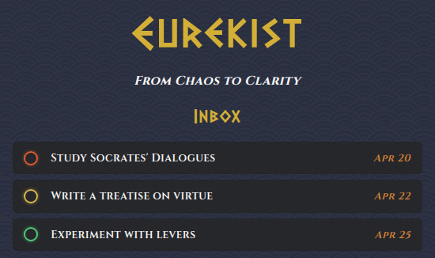

# Eurekist

<div align="center">



### TOP: Project Todo List

**An Ancient Greece-themed todo list application built with:**

[](https://html.spec.whatwg.org/)
[](https://www.w3.org/Style/CSS/)
[](https://developer.mozilla.org/en-US/docs/Web/JavaScript)
[](https://webpack.js.org/)

[Live Demo](https://batetdev.github.io/top-project-todo-list/) · [View Code](https://github.com/BatetDev/top-project-todo-list/tree/main)

</div>

## About

A basic todo list application created as part of The Odin Project's JavaScript course. The project emphasizes object-oriented programming principles, modern JavaScript features, and local storage integration.

### Key Features

- Create, edit, and delete tasks with detailed properties
- Organize tasks into custom projects
- Mark tasks as complete
- Local storage persistence
- Priority levels with visual indicators
- Due date tracking
- Responsive design with Greek philosophy theme
- Archive completed tasks

### Built With

- HTML5 for structure
- CSS3 for styling and animations
- JavaScript (ES6+) for functionality
- Webpack for module bundling
- date-fns for date manipulation
- Lucide for icons
- LeonardoIA for fallback images
- Heropatterns for background pattern

## Getting Started

```bash
# Clone the repository
git clone https://github.com/BatetDev/top-project-todo-list.git

# Navigate to project directory
cd top-project-todo-list

# Install dependencies
npm install

# Run development server
npm run start

# Build for production
npm run build
```

## Credits

- Original project by: [The Odin Project](https://www.theodinproject.com/lessons/node-path-javascript-todo-list)
- Icons: [Lucide Icons](https://lucide.dev/)
- Date handling: [date-fns](https://date-fns.org/)
- Background pattern by: [Hero Patterns](https://heropatterns.com/)
- Fallback images generated with: [Leonardo.AI](https://leonardo.ai/)
